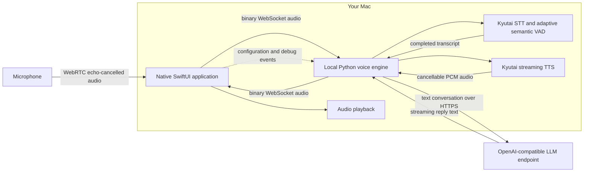

# Local Voice Assistant

Local Voice Assistant is a local-first, real-time voice interface for Apple Silicon Macs. It combines a focused native macOS experience with on-device speech processing and an OpenAI-compatible reasoning endpoint of your choice.

The primary interface is a borderless floating orb designed for continuous conversation. A dedicated Debug Mode provides the conversation timeline, operational telemetry, and runtime configuration needed to inspect and tune the voice pipeline.

## Highlights

- Local speech recognition, adaptive semantic turn detection, and speech synthesis on Apple Silicon
- Streaming conversation with interruption support: speak while the assistant is responding to take the floor
- Echo-cancelled WebRTC capture and playback embedded invisibly inside the native macOS interface
- Floating, borderless voice interface with distinct connecting, listening, idle, and speaking states
- Live transcript and reply captions that clear automatically
- Configurable assistant identity, behavior, endpoint, model, and credentials
- Timestamped conversation history and turn-level diagnostic logs
- Credentials stored in the macOS Keychain

## Data flow and architecture



The macOS app manages the native interface, settings, and debug workspace. A visually hidden local WebKit surface keeps microphone capture and assistant playback in one WebRTC/WebAudio graph so acoustic echo cancellation has the correct playback reference. The local engine keeps the MLX speech models warm and fuses recognized speech, semantic pause prediction, and an adaptive room-noise floor to detect the end of a user turn. It then streams text to the configured LLM and synthesizes the reply. A new user turn cancels active generation and playback without unloading the speech models.

The app and engine exchange JSON state/text events and binary audio frames over a local WebSocket. Engine readiness is exposed through a local HTTP health endpoint.

## Requirements

- Apple Silicon Mac
- macOS 14 or later
- Homebrew Python 3.12 at `/opt/homebrew/bin/python3.12`
- An OpenAI-compatible chat-completions endpoint, such as LM Studio or a hosted provider
- Internet access for the initial speech-model download

The initial setup downloads approximately 6.4 GB of model weights. They are subsequently loaded from the local Hugging Face cache.

## Quick start

Install the local engine, its dependencies, and validate the speech stack:

```bash
scripts/setup-kyutai.sh
```

Build and launch the native application:

```bash
scripts/build-local-voice-assistant-app.sh
open "Local Voice Assistant.app"
```

macOS requests microphone access on first launch. A changed bundle identifier or signing identity is treated as a new application by macOS and can require permission again.

## Configuration

Right-click the floating orb and select **Open Debug Mode**. In the configuration panel, set:

- **Agent name** — included in the system context
- **System instructions** — response style and behavior
- **API endpoint** — the OpenAI-compatible base URL
- **Model** — model identifier accepted by the endpoint
- **API key** — optional for local endpoints; stored in Keychain

Select **Save & Restart** to apply changes. For a local LM Studio server, use an endpoint such as `http://localhost:1234/v1`.

For unattended or repeatable setup, copy `config/local.env.example` to `config/local.env` and set the same values there. The local configuration file is excluded from Git.

## Operations and diagnostics

Debug Mode is the operational view for the assistant. It includes:

- A unified user/assistant transcript with timestamps and turn IDs
- Engine status and local system metrics
- Explicit VAD endpoint decisions, raw and smoothed pause scores, adaptive thresholds, turn ownership, and cancellation sources
- LLM and agent configuration

Log files are written to:

- `logs/kyutai-agent.log` — engine startup, voice turns, and cancellation lifecycle
- `logs/local-voice-assistant.log` — native application process output

For local integration diagnostics, the engine health endpoint is `http://127.0.0.1:8999/health` and its WebSocket service is `ws://127.0.0.1:9000`.

## Privacy

Audio capture, VAD, transcription, and speech synthesis stay on the Mac. The configured LLM receives text conversation data, including the assistant context necessary to sustain a conversation. Use a local endpoint for a fully local text path, or review the data policy of any hosted provider before use.

## Repository layout

```text
apps/LocalVoiceAssistant/   Native SwiftUI macOS application
engine/kyutai/              Local STT, VAD, LLM, and TTS engine
config/                     Example local configuration
scripts/                    Setup and application build scripts
```

The Kyutai MLX runtime is an internal speech-engine dependency; it is not part of the application or bundle naming.

## License

Distributed under the [MIT License](LICENSE).
