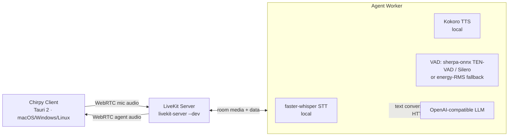

# Chirpy

Chirpy is a local-first, real-time voice assistant for Apple Silicon Macs. It combines a focused native desktop experience with on-device speech processing and an OpenAI-compatible reasoning endpoint of your choice.

The primary interface is a borderless floating orb designed for continuous conversation. A dedicated Debug Mode provides the conversation timeline, operational telemetry, and runtime configuration needed to inspect and tune the voice pipeline.

## Contents

- [Highlights](#highlights)
- [Architecture](#architecture)
- [Requirements](#requirements)
- [Quick start](#quick-start)
- [Configuration](#configuration)
- [Operations and diagnostics](#operations-and-diagnostics)
- [Barge-in and natural conversation](#barge-in-and-natural-conversation)
- [Testing](#testing)
- [Privacy](#privacy)
- [Repository layout](#repository-layout)
- [License](#license)

## Highlights

- Local speech recognition and speech synthesis on-device (faster-whisper STT + Kokoro TTS)
- Turn-based conversation with DTLN noise suppression on the mic input
- Full barge-in support: interrupt the assistant mid-speech and it stops talking
  and listens (pluggable local VAD — sherpa-onnx TEN-VAD/Silero, or an
  energy-RMS fallback — no cloud dependency)
- Media routing and echo-cancelled capture handled by a self-hosted LiveKit server
- Floating, borderless voice interface with distinct connecting, listening, idle, and speaking states
- Live transcript and reply captions that clear automatically
- Configurable assistant identity, behavior, endpoint, model, and credentials
- Timestamped conversation history and turn-level diagnostic logs
- Credentials stored in the OS keychain

## Architecture

Chirpy is split into a multiplatform desktop client and a local Python agent worker, connected through a self-hosted LiveKit server.



- **Client** — a Tauri 2 app (Rust + webview) that connects to the LiveKit room, publishes the echo-cancelled microphone, and plays the agent's audio. The Rust backend spawns `livekit-server --dev` and the agent worker, and issues room tokens.
- **LiveKit server** — the self-hosted SFU that routes media between the client and the agent worker.
- **Agent worker** — a Python `livekit-agents` process that runs the voice pipeline: a pluggable local VAD (sherpa-onnx TEN-VAD/Silero, or an energy-RMS fallback), faster-whisper STT, an OpenAI-compatible LLM, and Kokoro TTS, with DTLN noise suppression on the inbound audio.

## Requirements

- Apple Silicon Mac
- macOS 14 or later
- Homebrew Python 3.12 at `/opt/homebrew/bin/python3.12`
- Homebrew (for `livekit-server`)
- An OpenAI-compatible chat-completions endpoint, such as LM Studio or a hosted provider
- Internet access for the initial speech-model download

The initial setup downloads the small local speech models (faster-whisper `base` ~145 MB and Kokoro ~80 MB). They are subsequently loaded from the local Hugging Face cache.

## Quick start

Install the local engine, its dependencies, the LiveKit server, and validate the speech stack:

```bash
scripts/setup.sh
```

Build and launch the native application:

```bash
scripts/build-chirpy-app.sh
open "Chirpy.app"
```

macOS requests microphone access on first launch. A changed bundle identifier or signing identity is treated as a new application by macOS and can require permission again.

## Configuration

Right-click the floating orb and select **Open Debug Mode**. In the configuration panel, set:

- **Agent name** — included in the system context
- **System prompt** — the complete persistent LLM system message; `{{agent_name}}` expands to the configured agent name, and **Reset to Default** restores the built-in prompt
- **API endpoint** — the OpenAI-compatible base URL
- **Model** — model identifier accepted by the endpoint
- **API key** — optional for local endpoints; stored in the OS keychain

Select **Save & Restart** to apply changes. For a local LM Studio server, use an endpoint such as `http://localhost:1234/v1`.

For unattended or repeatable setup, copy `config/local.env.example` to `config/local.env` and set the same values there. The local configuration file is excluded from Git.

## Operations and diagnostics

Debug Mode is the operational view for the assistant. It includes:

- A unified user/assistant transcript with timestamps and turn IDs
- Backend status and local system metrics
- LiveKit server and agent worker logs
- LLM and agent configuration

Log files are written to:

- `logs/livekit-server.log` — the self-hosted LiveKit server
- `logs/chirpy-agent.log` — the agent worker (voice turns, model loading, errors)

## Barge-in and natural conversation

Barge-in (interrupting the assistant mid-speech) is **enabled by default**. The
agent uses the local pluggable VAD (sherpa-onnx neural by default) to detect
that you started speaking, stops its own audio immediately, and listens for your
new turn. Interruption is driven by the local VAD (`INTERRUPTION_MODE=vad`) so
it works fully offline against a self-hosted LiveKit server; the cloud
`adaptive` mode is opt-in, needs hosted API credentials, and **auto-falls back
to `vad`** when they are absent.

Barge-in is a **data-driven policy, not hardcoded numbers**. The defaults mirror
LiveKit's own natural interruption policy and live in `engine/chirpy/bargein.py`;
every knob is configurable via `config/local.env.example` and can be tuned live
without a rebuild through `config/barge-in.json` (copy the `.example`). Key
settings:

| Setting | Effect |
| --- | --- |
| `BARGE_IN` | Master switch (default `true`) |
| `INTERRUPTION_MODE` | `vad` (local) or `adaptive` (cloud; falls back to `vad`) |
| `BARGE_IN_MIN_DURATION` / `BARGE_IN_MIN_WORDS` | How much real speech counts as a barge-in |
| `BARGE_IN_FALSE_TIMEOUT` / `BARGE_IN_RESUME_FALSE` | Resume the reply after a false start |
| `BARGE_IN_BACKCHANNEL` | Suppress interruptions near turn edges (backchannels, echo onset) |
| `AEC_WARMUP_DURATION` | Keep interruptions disabled while echo cancellation converges |
| `ECHO_OVERLAP_THRESHOLD` | Content-based echo guard sensitivity (0..1) |
| `ENDPOINTING_MIN_DELAY` / `ENDPOINTING_MAX_DELAY` | End-of-turn timing |

### Robustness against bogus barge-ins

Pure VAD over-triggers on backchannels, coughs, typing and — most importantly —
the agent's **own speaker echo** being picked up by the mic, which makes the
agent appear to stop on its own. (LiveKit's hosted adaptive model rejects ~51%
of VAD interruptions as false, but it isn't available self-hosted.) Chirpy
instead layers local measures, all config-driven:

1. **AEC warm-up** — interruptions stay off for `AEC_WARMUP_DURATION` while
   acoustic echo cancellation converges.
2. **Backchannel boundary** — interruptions near the start/end of an agent turn
   are suppressed, so brief interjections don't halt the reply.
3. **False-interruption resume** — if the user goes silent shortly after an
   interruption, the reply resumes.
4. **Echo guard** (`engine/chirpy/echoguard.py`) — if a "user" transcript
   substantially overlaps the agent's own recent words, it's classified as
   speaker echo and withheld from the transcript instead of becoming a turn.
5. **Pluggable VAD** (`engine/chirpy/vad/`) — a roomkit-style `agents.vad.VAD`
   layer. Point `VAD_MODEL` at a sherpa-onnx `.onnx` (TEN-VAD or Silero) for the
   neural VAD, or leave it unset for the zero-dependency energy-RMS fallback.
   The neural VAD adds an **energy fast-exit** that forces end-of-speech when the
   model stays in speech on true silence — the "agent stops on its own"
   echo/tail case. Threshold and silence timing are data-driven (below).

| VAD setting | Default | Notes |
| --- | --- | --- |
| `VAD_MODEL` | — | Path to a sherpa-onnx `.onnx` (TEN-VAD or Silero); empty ⇒ energy fallback |
| `VAD_MODEL_TYPE` | `ten` | `ten` (TEN-VAD) or `silero` |
| `VAD_THRESHOLD` | `0.35` | Speech probability; `0.5` without a denoiser, `0.35` with one |
| `VAD_SILENCE_MS` | `500` | Silence before end-of-speech; raise to 600–800 if cut off |
| `VAD_MIN_SPEECH_MS` | `250` | Minimum speech segment length |
| `VAD_SPEECH_PAD_MS` | `300` | Pre-roll padding so utterance onsets aren't clipped |
| `VAD_ENERGY_SILENCE_RMS` | `0.0006` | Energy fast-exit gate; `0` disables |

Download a TEN-VAD model with:

```bash
wget https://github.com/k2-fsa/sherpa-onnx/releases/download/asr-models/ten-vad.onnx -O engine/chirpy/.models/ten-vad.onnx
```

You can tune sensitivity live by editing `config/barge-in.json`; endpointing
applies immediately, and interruption options on the next room/restart.

## Testing

The agent's barge-in and turn-taking configuration is covered by a pure
`unittest` suite that runs without a LiveKit server, local speech models, or an
LLM endpoint:

```bash
engine/chirpy/.venv/bin/python -m unittest discover -s tests -v
```

## Privacy

Audio capture, VAD, transcription, and speech synthesis stay on the Mac. The configured LLM receives text conversation data, including the assistant context necessary to sustain a conversation. Use a local endpoint for a fully local text path, or review the data policy of any hosted provider before use.

## Repository layout

```text
apps/chirpy/             Tauri 2 multiplatform desktop client
engine/chirpy/           Local STT/TTS models + LiveKit agent worker
  plugins/               faster-whisper STT + Kokoro TTS LiveKit Agents plugins
config/                  Example local configuration
scripts/                 Setup and application build scripts
```

The speech models are small, on-device dependencies; they are not part of the application or bundle naming.

## License

Distributed under the [MIT License](LICENSE).
