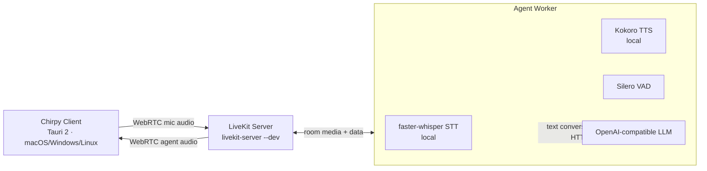

# Chirpy

Chirpy is a local-first, real-time voice assistant for Apple Silicon Macs. It combines a focused native desktop experience with on-device speech processing and an OpenAI-compatible reasoning endpoint of your choice.

The primary interface is a borderless floating orb designed for continuous conversation. A dedicated Debug Mode provides the conversation timeline, operational telemetry, and runtime configuration needed to inspect and tune the voice pipeline.

## Highlights

- Local speech recognition and speech synthesis on-device (faster-whisper STT + Kokoro TTS)
- Streaming conversation with interruption support: speak while the assistant is responding to take the floor
- Media routing and echo-cancelled capture handled by a self-hosted LiveKit server
- Floating, borderless voice interface with distinct connecting, listening, idle, and speaking states
- Live transcript and reply captions that clear automatically
- Configurable assistant identity, behavior, endpoint, model, and credentials
- Timestamped conversation history and turn-level diagnostic logs
- Credentials stored in the OS keychain

## Architecture

Chirpy is split into a multiplatform desktop client and a local Python agent worker, connected through a self-hosted LiveKit server.



- **Client** — a Tauri 2 app (Rust + webview) that connects to the LiveKit room, publishes the echo-cancelled microphone, and plays the agent's audio. The Rust backend spawns `livekit-server --dev` and the agent worker, and issues room tokens.
- **LiveKit server** — the self-hosted SFU that routes media between the client and the agent worker.
- **Agent worker** — a Python `livekit-agents` process that runs the voice pipeline: Silero VAD, faster-whisper STT, an OpenAI-compatible LLM, and Kokoro TTS. Turn detection and barge-in are LiveKit-native.

## Requirements

- Apple Silicon Mac
- macOS 14 or later
- Homebrew Python 3.12 at `/opt/homebrew/bin/python3.12`
- Homebrew (for `livekit-server`)
- An OpenAI-compatible chat-completions endpoint, such as LM Studio or a hosted provider
- Internet access for the initial speech-model download

The initial setup downloads the small local speech models (faster-whisper `base` ~145 MB and Kokoro ~80 MB). They are subsequently loaded from the local Hugging Face cache.

## Quick start

Install the local engine, its dependencies, the LiveKit server, and validate the speech stack:

```bash
scripts/setup-kyutai.sh
```

Build and launch the native application:

```bash
scripts/build-chirpy-app.sh
open "Chirpy.app"
```

macOS requests microphone access on first launch. A changed bundle identifier or signing identity is treated as a new application by macOS and can require permission again.

## Configuration

Right-click the floating orb and select **Open Debug Mode**. In the configuration panel, set:

- **Agent name** — included in the system context
- **System prompt** — the complete persistent LLM system message; `{{agent_name}}` expands to the configured agent name, and **Reset to Default** restores the built-in prompt
- **API endpoint** — the OpenAI-compatible base URL
- **Model** — model identifier accepted by the endpoint
- **API key** — optional for local endpoints; stored in the OS keychain

Select **Save & Restart** to apply changes. For a local LM Studio server, use an endpoint such as `http://localhost:1234/v1`.

For unattended or repeatable setup, copy `config/local.env.example` to `config/local.env` and set the same values there. The local configuration file is excluded from Git.

## Operations and diagnostics

Debug Mode is the operational view for the assistant. It includes:

- A unified user/assistant transcript with timestamps and turn IDs
- Backend status and local system metrics
- LiveKit server and agent worker logs
- LLM and agent configuration

Log files are written to:

- `logs/livekit-server.log` — the self-hosted LiveKit server
- `logs/chirpy-agent.log` — the agent worker (voice turns, model loading, errors)

## Privacy

Audio capture, VAD, transcription, and speech synthesis stay on the Mac. The configured LLM receives text conversation data, including the assistant context necessary to sustain a conversation. Use a local endpoint for a fully local text path, or review the data policy of any hosted provider before use.

## Repository layout

```text
apps/chirpy/             Tauri 2 multiplatform desktop client
engine/kyutai/           Local STT/TTS models + LiveKit agent worker
  plugins/               faster-whisper STT + Kokoro TTS LiveKit Agents plugins
config/                  Example local configuration
scripts/                 Setup and application build scripts
```

The speech models are small, on-device dependencies; they are not part of the application or bundle naming.

## License

Distributed under the [MIT License](LICENSE).
