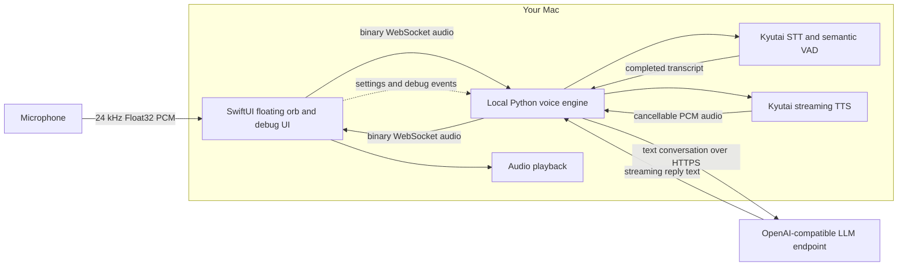

# Local Voice Assistant

A native, real-time voice assistant for Apple Silicon Macs. The default interface is a borderless floating orb; right-click it to open a detailed debug workspace.

Speech recognition, voice activity detection, and speech synthesis run locally. Only text conversation data is sent to the OpenAI-compatible LLM endpoint you configure.

## Features

- Floating orb with loading, listening, idle, and speaking animations
- Live user transcript and assistant reply that fade automatically
- Natural turn detection and barge-in while the assistant is speaking
- Configurable agent name, system instructions, LLM endpoint, model, and API key
- Unified, timestamped conversation view in Debug Mode
- Turn-aware engine logs with endpoint and cancellation reasons
- Local Apple Silicon speech pipeline using MLX
- API credentials stored in the macOS Keychain

## Requirements

- Apple Silicon Mac
- macOS 14 or later
- Homebrew Python 3.12 at `/opt/homebrew/bin/python3.12`
- An OpenAI-compatible chat-completions endpoint, such as LM Studio
- Internet access during initial setup to download the speech model weights

The initial model download is several gigabytes. Later runs use the local Hugging Face cache.

## Install and run

Set up the Python environment and validate the local speech models:

```bash
scripts/setup-kyutai.sh
```

Build and open the native app:

```bash
scripts/build-local-voice-assistant-app.sh
open "Local Voice Assistant.app"
```

macOS asks for microphone access on first launch. Changing the bundle identifier or rebuilding with a different signing identity can make macOS treat the build as a new app and request permission again.

## Configure the assistant

Right-click the orb and choose **Open Debug Mode**. In **Configuration**, enter:

- **Agent name** — included in the assistant's system context
- **System instructions** — defines its behavior and response style
- **API endpoint** — the OpenAI-compatible base URL
- **Model** — the model name expected by that endpoint
- **API key** — optional for local endpoints; stored in Keychain

Choose **Save & Restart** to apply the settings. For LM Studio, a typical endpoint is `http://localhost:1234/v1`.

You can also copy `config/local.env.example` to `config/local.env` and edit it directly. The local file is ignored by Git.

## Architecture



The Swift app owns the window, microphone capture, audio playback, connection state, transient captions, settings, and debug UI. It starts and stops the Python engine with the app.

The Python engine keeps the MLX speech models loaded, converts microphone audio into text, detects the end of each user turn, streams the transcript to the configured LLM, synthesizes the reply, and returns PCM audio. A new user turn can cancel an active assistant turn, enabling barge-in without restarting the models.

The two processes communicate through a small protocol: JSON events carry state and text, while binary WebSocket frames carry audio. Readiness is exposed separately over local HTTP.

## Debugging

Right-click the orb and open **Debug Mode** to see:

- The unified user and assistant conversation with timestamps and turn IDs
- Engine readiness and local system metrics
- Turn ownership, VAD endpoint decisions, cancellations, and failure reasons
- LLM and agent configuration

Persistent logs are written to:

- `logs/kyutai-agent.log` — Python engine and turn lifecycle
- `logs/local-voice-assistant.log` — native app process output

The local health endpoint is `http://127.0.0.1:8999/health`; the audio session uses `ws://127.0.0.1:9000`.

## Project structure

```text
apps/LocalVoiceAssistant/   Native SwiftUI macOS application
engine/kyutai/              Local STT, VAD, LLM, and TTS engine
config/                     Example local configuration
scripts/                    Setup and app build scripts
```

The upstream Kyutai MLX runtime remains an internal speech-engine dependency. It is not used in the app, target, executable, or bundle naming.

## Privacy

Microphone audio, VAD, STT, and TTS stay on the Mac. The completed transcript and conversation context are sent to the configured LLM endpoint, which may be local or remote. Review your endpoint provider's data policy before using a hosted service.

## License

This project is available under the [MIT License](LICENSE).
